# nf-DNA-seq Pipeline

## Overview

`nf-DNA-seq` is a Nextflow-based pipeline for Long Read DNA sequencing analysis. It automates key steps such as reference indexing, alignment, quality control, variant calling, filtering, and reporting. The pipeline is modular, with each step defined in separate Nextflow modules for flexibility and maintainability.

## Directory Structure

```
nf-DNA-seq/
├── nextflow.config
├── workflow.nf
└── modules/
    ├── align.nf
    ├── call_stats.nf
    ├── filter_variants.nf
    ├── index_ref.nf
    ├── mkdp.nf
    ├── multiqc.nf
    ├── trim.nf
    ├── qc.nf
    ├── variant_annotate.nf
    └── variant_call.nf
```

## Pipeline Steps

1. **Reference Indexing (`index_ref.nf`)**  
   Indexes the reference genome for downstream analysis.

2. **Alignment (`align.nf`, `Minimap2`)**  
   Aligns sequencing reads to the reference genome.

3. **Trimming (`trim.nf`,`NanoFilt`)**
   Trims low-quality bases and adapter from the sequencing reads.

3. **Quality Control (`qc.nf`, `NanoPlot`)**  
   Performs QC on raw and aligned reads using tools like NanoPlot.

4. **Variant Calling (`variant_call.nf`, `clair3`)**  
   Calls variants using Clair3.

5. **Variant Filtering (`filter_variants.nf`, `bcftools`)**
   Filters called variants based on quality and other metrics.

5. **Variant Annotation (`variant_annotate.nf`, `vep`)**
   Annotates variants using VEP (Variant Effect Predictor).

6. **Statistics (`call_stats.nf`, `bcftools`)**
   Generates summary statistics.

## Pipeline DAG

You can view the pipeline's workflow DAG here:

[](dag-Entry.svg)

## Requirements

### Software

- [Nextflow](https://www.nextflow.io/)
- [Conda](https://docs.conda.io/en/latest/)
- [Python 3.7+](https://www.python.org/)

### Python Dependencies

Before running the pipeline, create and activate a conda environment

```bash
conda create -n nf_env python=3.10
conda activate nf_env
```

Or, using conda:

```bash
conda install -c bioconda clair3 nanoplot multiqc nextflow nf-core nanofilt
conda install -c conda-forge graphviz
pip install "tensorflow==2.10.1" "keras==2.10.0"
```

> **Note:**  
> Some tools (like Clair3) may have additional dependencies or require installation from their official repositories. Refer to their documentation for advanced usage.

### Other Dependencies

- Reference genome files (FASTA format)
- Sequencing reads (FASTQ format)

## Usage

1. **Clone the repository:**
   ```bash
   git clone https://github.com/SiddharthRajesh2003/Nextflow-based-Variant-Calling-Pipeline.git
   cd nf-DNA-seq
   ```
1. **Make sure that your HPC contains tools like GATK, samtools etc.**
   ```bash
   module avail gatk
   module avail samtools
   module avail bcftools
   module avail sra-toolkit
   ```

2. **Configure the pipeline:**
   - Edit `nextflow.config` to set paths and parameters as needed.

3. **Prepare your data:**
   - Place your reference genome and sequencing reads in the appropriate directories.
   - Use [download.sh](download.sh) to fetch SRA and reference files.

4. **Run the pipeline:**
   ```bash
   nextflow run workflow.nf \
    -resume \
    -with-timeline ${OUTPUT_DIR}/pipeline_info/execution_timeline_${SLURM_JOB_ID}.html \
    -with-report ${OUTPUT_DIR}/pipeline_info/execution_report_${SLURM_JOB_ID}.html \
    -with-trace ${OUTPUT_DIR}/pipeline_info/execution_trace_${SLURM_JOB_ID}.txt \
    -with-dag ${OUTPUT_DIR}/pipeline_info/pipeline_dag_${SLURM_JOB_ID}.svg
   ```

   - Additional parameters can be set via the command line or in `nextflow.config`.

## Output

Results will be saved in the specified output directory, including:
- Aligned BAM files
- QC reports
- Variant call files (VCF)
- Summary Statistics
- Filtered variants
- Annotated Variants
- MultiQC summary reports

## Troubleshooting

- Ensure all dependencies are installed and available in your PATH.
- If using a cluster, load required modules (e.g., conda, python) before running Nextflow.
- Check log files for error messages and consult the documentation for each tool.

## References

- [Nextflow Documentation](https://www.nextflow.io/docs/latest/index.html)
- [Clair3](https://github.com/HKU-BAL/Clair3)
- [NanoPlot](https://github.com/wdecoster/NanoPlot)
- [MultiQC](https://multiqc.info/)
